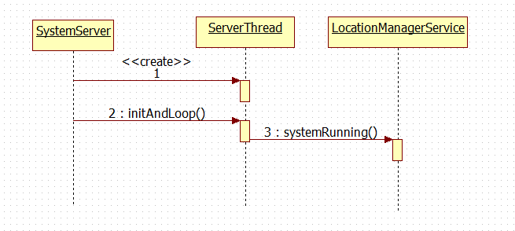

LocationManagerService的启动时序如下

`SystemServer` 代码路径为 platform\_frameworks\_base\services\java\com\android\server\SystemServer.java

# 0. 创建 `ServerThread`
从 `SystemServer.main()` 方法开始执行，这个方法中会创建 `ServerThread` 对象

	public class SystemServer {
	    private static final String TAG = "SystemServer";
	
	    /**
	     * Called to initialize native system services.
	     */
	    private static native void nativeInit();
	
	    public static void main(String[] args) {
	        System.loadLibrary("android_servers");
	
	        Slog.i(TAG, "Entered the Android system server!");
	
	        // Initialize native services.
	        nativeInit();
	
	        // This used to be its own separate thread, but now it is
	        // just the loop we run on the main thread.
	        ServerThread thr = new ServerThread();
	        thr.initAndLoop();
	    }
	}

# 1. `initAndLoop`
`ServerThread.initAndLoop()` 方法初始化各个 `Service` 并开始消息循环，这里包括 `LocationManagerService`

    public void initAndLoop() {

		boolean disableLocation = SystemProperties.getBoolean("config.disable_location", false);

	    if (!disableLocation) {
	        try {
	            location = new LocationManagerService(context);
	            ServiceManager.addService(Context.LOCATION_SERVICE, location);
	        } catch (Throwable e) {
	            reportWtf("starting Location Manager", e);
	        }
	    }

        try {
            if (locationF != null) locationF.systemRunning();
        } catch (Throwable e) {
            reportWtf("Notifying Location Service running", e);
        }
	}

# 2. `systemRunning`
`LocationManagerService.systemRunning()` 方法可以简单地理解为：通知 `LocationManagerService` Android 系统已经启动