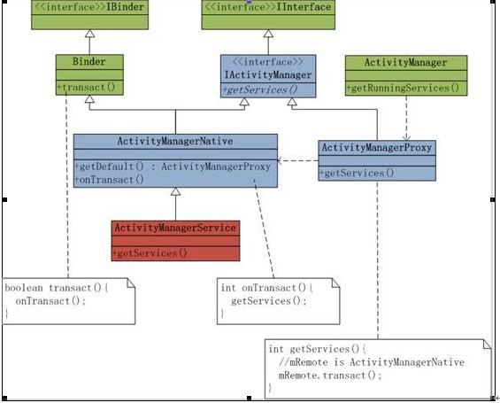
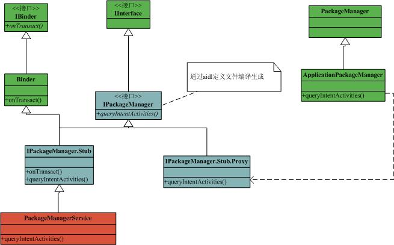

原文见 [这里][ActivityManager讲解]

原文总得很详细甚至啰嗦，所以我再提炼下。

一图胜千言，先上图：

+ IActivitManager： 定义了 ActivityManager 框架的所有操作
+ ActivityManagerProxy：代理类，实现了 IActivityManager 接口。它只有一个成员：`IBinder`
+ ActivityManagerNative：抽象类，继承 Binder 并实现了 IActivityManager 接口。它最核心的部分是 `onTransact` 方法
+ ActivityManagerService：继承 ActivityManagerNative

> ActivityManager 存在于用户进程中，由用户进程调用获取 Activity 管理的一些基本信息。

> ActivityManager 类并不真正执行上述这些操作，操作的真正执行是在 system_process 进程中的 ActivityManagerService 。ActivityManagerService 作为一个服务在 system_process 进程启动时被创建的

其时，`PackageManager` 也是同样的套路，如下图：

原文见 [这里][PackageManager分析]

[ActivityManager讲解]: http://blog.csdn.net/stonecao/article/details/6579710
[PackageManager分析]: http://blog.csdn.net/stonecao/article/details/6591454