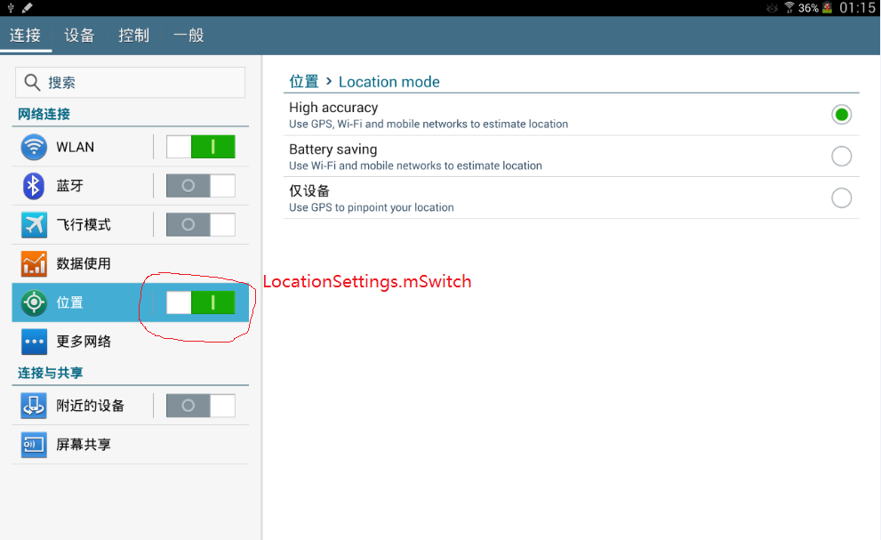

# 问题现象

安装定位apk后，影响

# 问题现象

如上图，在 `High accuracy` 和 `仅设备` 之间切换时正常，但如果切换到 `Battery saving` 时， `位置` 功能自动关闭。

非常奇怪。 

`Switch` 上注册有监听器

	mSwitch.setOnCheckedChangeListener(this);

监听器如下：`mSwitch` 开时默认打开 `High accuracy`, 否则关闭位置功能

    /**
     * Listens to the state change of the location master switch.
     */
    @Override
    public void onCheckedChanged(CompoundButton buttonView, boolean isChecked) {
        if (isChecked) {
            setLocationMode(Settings.Secure.LOCATION_MODE_HIGH_ACCURACY);
        } else {
            setLocationMode(Settings.Secure.LOCATION_MODE_OFF);
        }
    }

`LocationSettingsBase` 是一个抽象类, 继承自 `SettingsPreferenceFragment`

`LocationSettings` 继承自 `LocationSettingsBase`。 

仍然看上图， `LocationSettings` 

1. 提供一个 `Switch`
2. 提供右侧的UI

`LocationSettings.createPreferenceHierarchy` 方法如下：

    private PreferenceScreen createPreferenceHierarchy() {
        final PreferenceActivity activity = (PreferenceActivity) getActivity();
        addPreferencesFromResource(R.xml.location_settings);
        root = getPreferenceScreen();

        mLocationMode = root.findPreference(KEY_LOCATION_MODE);
        mLocationMode.setOnPreferenceClickListener(
                new Preference.OnPreferenceClickListener() {
                    @Override
                    public boolean onPreferenceClick(Preference preference) {
						// 启动 LocationMode 
                        activity.startPreferencePanel(...);
                        return true;
                    }
                });

        // 显示最近使用定位功能的 app
		...

        // Only show the master switch when we're not in multi-pane mode, and not being used as
        // Setup Wizard.
        if (activity.onIsHidingHeaders() || !activity.onIsMultiPane()) {
            ...
	
			// 将 Switch 添加到主UI中去
            activity.getActionBar().setCustomView(mSwitch, ...);
        }

        setHasOptionsMenu(true);

        refreshLocationMode();
        return root;
    }

`LocationMode` 也继承自 `LocationSettingsBase` , (不得不说比较巧妙, 学习之 , base类仅实现逻辑而不提供ui)

`systemRunning()` 有两个功能。

1. 准备各种 Provider。 包括我们的 Network Provider
2. 准备好之后更新 `Provider` 的状态
2. 监听 Settings 的改变。 这个改变见 之前的图片。
3. 
4. 

LocationProviderProxy.createAndBind

    private void bindToPackageLocked(String packageName, int version, boolean isMultiuser) {
        unbindLocked();
        Intent intent = new Intent(mAction);
        intent.setPackage(packageName);
        mPackageName = packageName;
        mVersion = version;
        mIsMultiuser = isMultiuser;
        if (D) Log.d(mTag, "binding " + packageName + " (version " + version + ") ("
                + (isMultiuser ? "multi" : "single") + "-user)");
        mContext.bindServiceAsUser(intent, this, Context.BIND_AUTO_CREATE | Context.BIND_NOT_FOREGROUND
                | Context.BIND_NOT_VISIBLE, mIsMultiuser ? UserHandle.OWNER : UserHandle.CURRENT);
    }

这里绑定的目标是我们提供的 app  

绑定成功后会调用 `onServiceConnected` 回调

    public void onServiceConnected(ComponentName name, IBinder binder) {
		...
        mBinder = binder;
		...
        mHandler.post(mNewServiceWork);
		...
    }

1. 保存远程 `binder` 对象的引用
2. 调用某个功能 `mNewServiceWork`

注意： 保存引用非常重要。 比如在 LocationProviderProxy 中就要进行远程 调用 

    private ILocationProvider getService() {
        return ILocationProvider.Stub.asInterface(mServiceWatcher.getBinder());
    }

这里的 `mNewServiceWork` 来自 `LocationProviderProxy` 对应的成员

