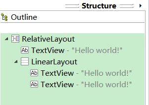

div 是块级元素，每个 div 在页面中单独占一行，自上而下排列。如下图

容易看出：即使div1的宽度很小，页面中一行可以容下div1和div2，div2也不会排在div1后边，
因为div元素是独占一行的。

_类比_

其实不难发现，div 所在的父容器很像 android 布局中的垂直方向的 LinearLayout

代码：

    <LinearLayout
        android:layout_width="wrap_content"
        android:layout_height="wrap_content"
        android:background="#eeeeee"
        android:orientation="vertical" >

        <TextView
            android:layout_width="wrap_content"
            android:layout_height="wrap_content"
            android:text="@string/hello_world"
            android:textColor="#ff0000" />

        <TextView
            android:layout_width="wrap_content"
            android:layout_height="wrap_content"
            android:text="@string/hello_world"
            android:textColor="#00ff00" />
    </LinearLayout>

结构：

效果：

核心问题：
**如何在一行显示多个div元素**

答案：
**浮动！**

>浮动可以理解为让某个div元素脱离标准流，漂浮在标准流之上，和标准流不是一个层次

>假如某个div元素A是浮动的，如果A元素上一个元素也是浮动的，那么A元素会跟随在上一个元素的后边(如果一行放不下这两个元素，那么A元素会被挤到下一行)；如果A元素上一个元素是标准流中的元素，那么A的相对垂直位置不会改变，也就是说A的顶部总是和上一个元素的底部对齐。

>div的顺序是HTML代码中div的顺序决定的。

>靠近页面边缘的一端是前，远离页面边缘的一端是后。

[demo][demo]

[CSS浮动(float,clear)通俗讲解]: http://blog.jobbole.com/37112/

[demo]: http://moon.sinaapp.com/static/css_3.html
